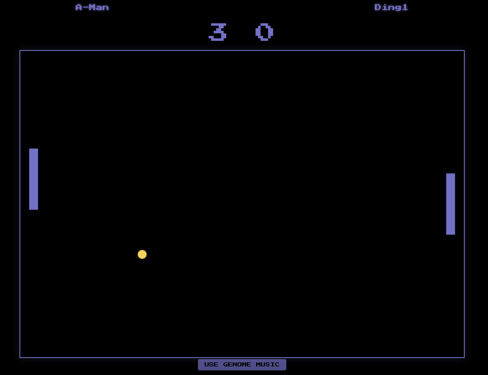
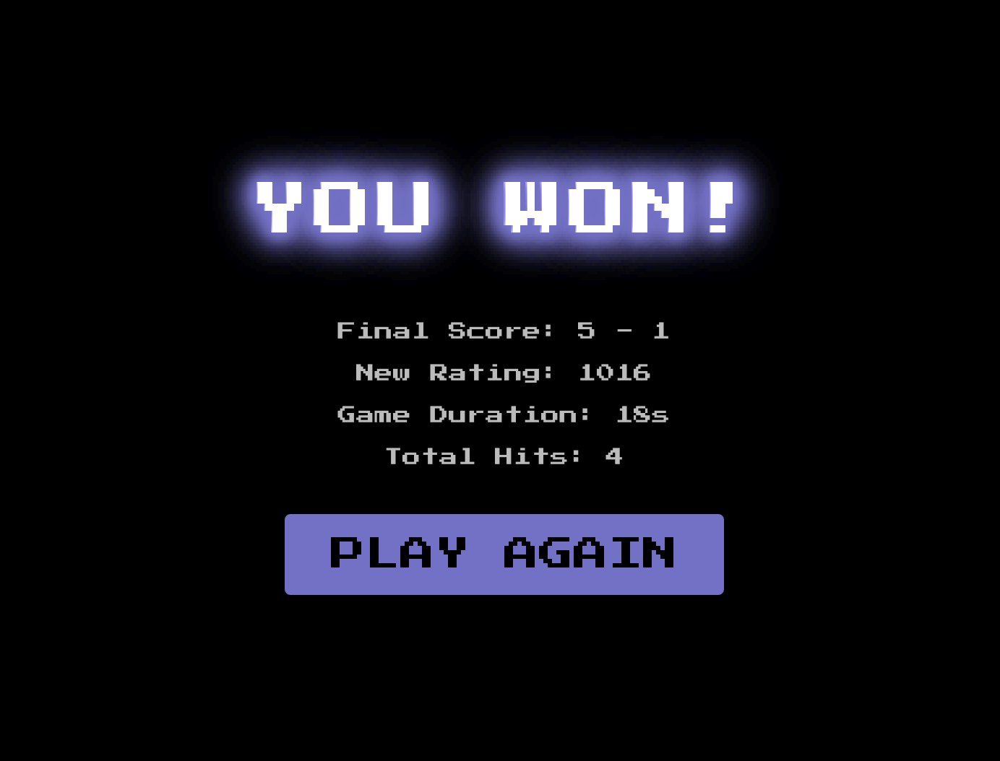

# K-PONG

A modern take on the classic Pong game with multiplayer support, ranking system, and retro vibes!

&nbsp;

## Features
- Real-time multiplayer gameplay
- ELO ranking system
- Retro-style graphics with modern smoothing
- Original 80's inspired soundtrack
- Genome based, procedural music track
- Match history and statistics
- Random player matchmaking

## Prerequisites
- Docker
- Docker Compose

## Getting Started

1. Clone the repository:
bash
git clone https://github.com/escapeSeq/k-pong.git
cd k-pong

2. Start the application:

bash
docker-compose up --build

3. Open your browser and navigate to:

http://localhost:3000

## Gameplay

1. Welcome screen:
- Enter your name and start the game

2. Gameplay:

- Use up and down arrow keys, or mouse, to move the paddle
- Try to hit the ball past your opponent's paddle
- First to score 5 points wins

3. Game Over:

- See your final score and rank
- View match history and statistics

## Technologies Used

- React
- Node.js
- Express
- Socket.io
- Docker
- Docker Compose

## Contributing

1. Fork the repository
2. Create a new branch
3. Make your changes and commit them
4. Push to your fork
5. Create a pull request

## License

This project is licensed under the MIT License. See the LICENSE file for details.

